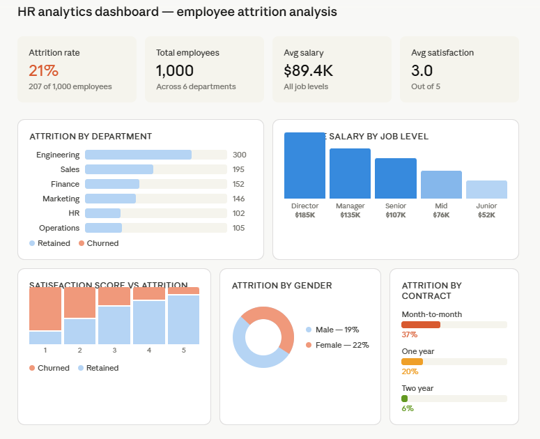

# HR Analytics Dashboard

## Executive Summary
This Power BI dashboard analyzes 1,000 employee records to uncover attrition patterns,
salary distributions, and satisfaction trends across departments, job levels, and gender.
Built to help HR teams make data-driven decisions on retention and workforce planning.

## Dashboard Preview

## Project Goal
Answer key HR business questions:
- What is the overall employee attrition rate?
- Which departments have the highest attrition?
- How does salary vary across job levels?
- Does satisfaction score correlate with attrition?
- Is there a gender gap in attrition rates?

## Tools Used
| Tool | Purpose |
|------|---------|
| Power BI Desktop | Dashboard development and visualization |
| Python (pandas) | Synthetic HR dataset generation |
| Git and GitHub | Version control and documentation |

## Dataset Overview
Synthetic HR dataset with 1,000 employee records.

| Field | Description |
|-------|-------------|
| employee_id | Unique employee identifier |
| age | Employee age (22-60) |
| gender | Male or Female |
| department | Engineering, Sales, HR, Finance, Marketing, Operations |
| job_level | Junior, Mid, Senior, Manager, Director |
| education | High School, Bachelor, Master, PhD |
| tenure_years | Years at company |
| salary | Annual salary based on job level |
| satisfaction_score | Score 1-5 (1=lowest, 5=highest) |
| performance_score | Score 1-5 |
| work_life_balance | Score 1-5 |
| attrition | Target variable (1=left, 0=stayed) |

## Key KPIs
| Metric | Value |
|--------|-------|
| Overall Attrition Rate | 21% |
| Total Employees | 1,000 |
| Average Salary | $91.5K |
| Average Satisfaction | 3.05 out of 5 |
| Highest Attrition Dept | Engineering |
| Gender Attrition Gap | Female 22% vs Male 19% |

## Dashboard Visuals
- Attrition Rate KPI Card
- Total Employees KPI Card
- Average Salary KPI Card
- Average Satisfaction Score KPI Card
- Salary by Job Level (column chart)
- Attrition by Department (horizontal bar chart)
- Satisfaction Score vs Attrition (clustered column)
- Attrition by Gender (donut chart)

## Business Insights
- Overall attrition rate is 21% — above the healthy 10-15% industry benchmark
- Engineering has the highest headcount and largest attrition volume
- Directors earn 3.5x more than Junior employees showing a steep salary curve
- Female employees churn at 22% vs 19% for male employees
- Employees with satisfaction score of 1-2 churn significantly more than those scoring 4-5
- Longer tenure strongly correlates with lower attrition risk

## Recommendations
- Launch targeted retention programs for Engineering and Sales departments
- Investigate root causes of low satisfaction scores among junior staff
- Review compensation bands for Mid-level employees showing high attrition
- Implement stay interviews for employees in their first 3 years
- Address gender attrition gap through equity and flexibility initiatives

## Project Structure
hr-analytics-powerbi/
├── data/
│   └── generate_hr_data.py
│   └── hr_data.csv
├── hr_analytics_dashboard.pbix
└── README.md

## How to Open
1. Install Power BI Desktop (free) from powerbi.microsoft.com
2. Clone this repository
3. Open hr_analytics_dashboard.pbix in Power BI Desktop

## Skills Demonstrated
- Power BI dashboard development
- KPI card design and DAX measures
- Multi-visual interactive dashboard layout
- HR domain knowledge and business insight generation
- Python data generation with pandas
- GitHub project documentation
